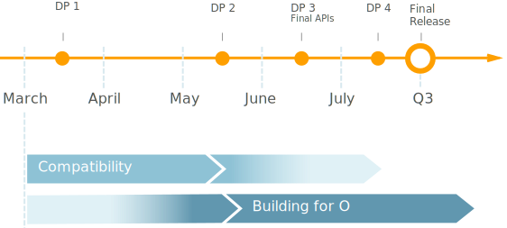
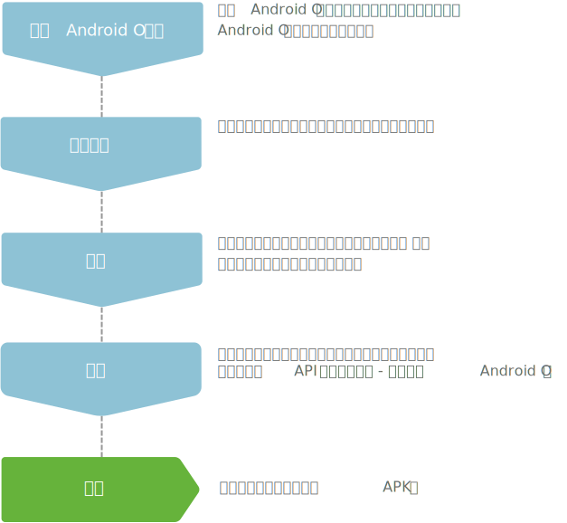
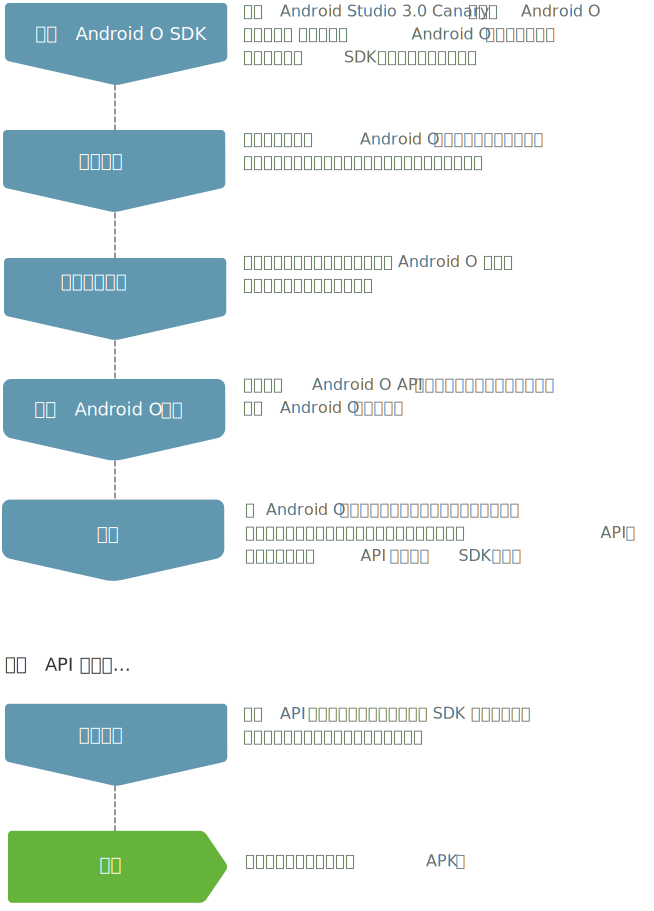

# 迁移应用到Android O
Android O引入了若干新的功能和API，并加入了即便您未对应用做任何更改仍可能对其行为产生影响的一些变动。为帮助您做好准备，本页面将说明如何执行兼容性测试，以及如何更新应用以便利用Android O的新功能：
* [确保平台兼容性](preview-migration.html#ct)

验证您的应用能够在新版本平台上全功能运行。在此阶段，您不需要使用新的API，也不需要更改应用的`targetSdkVersion`，但可能需要进行一些细微的更改。

* [使用Android O SDK构建应用](preview-migration.html#bfa)

当您准备好利用平台的新功能时，将`targetSdkVersion`更新至“O”，验证应用是否仍可按预期方式运行，然后开始使用新的API。


### 确保平台兼容性
这一步的目标是确保应用在Android O上可照常运行。由于一些平台变化可能影响应用的行为方式，因此可能需要进行一些调整，但您不需要使用新的API或更改`targetSdkVersion`。


### 准备一台运行Android O的设备
* 如果您有一台兼容设备（Pixel、Pixel XL、Pixel C、Nexus 5X、Nexus 6P或Nexus Player），请从[下载](preview-download.html)页面获得适合您的设备的Android O系统映像，然后按照说明[将映像刷入设备](https://developers.google.cn/android/images#instructions)。
* 或下载适用于Android Emulator的Android O系统映像。它列于[SDK 管理器](https://developer.android.google.cn/studio/intro/update.html##sdk-manager)的**Android O Preview**下，显示为**Google APIs Intel x86 Atom System Image**。
> 注：Android O系统映像只能通过[Android Studio 3.0 Canary](https://developer.android.google.cn/studio/preview/index.html)下载。如需了解详细信息，请参阅下面一节以[获取Android O SDK](https://developer.android.google.cn/preview/migration.html##ptb)。

### 执行兼容性测试
与Android O的兼容性测试多半与您准备发布应用时执行的测试属于同一类型。这时有必要回顾一下[核心应用质量准则](https://developer.android.google.cn/develop/quality-guidelines/core-app-quality.html)和[测试最佳做法](https://developer.android.google.cn/training/testing/index.html)。

不过，测试还有另一个层面：Android O向Android平台引入了一些变化，即便不对`targetSdkVersion`做任何变动，仍可能影响应用的行为或令其根本无法运行。因此，您必须回顾表 1中的关键变化，并对任何为适应这些变化而实现的修复进行测试。

**表 1**. 对运行在Android O设备上的所有应用都有影响的关键变化。

变化|摘要|其他参考资料
:--|:--|:--
后台位置更新频率下降|如果应用接收来自后台服务的位置更新，则其在Android O上接收更新的频率要比旧版本Android低。具体地讲，后台服务接收位置更新的频率不能超过每小时几次。不过，当应用位于前台时，位置更新频率不变。|[后台位置限制](https://developer.android.google.cn/preview/features/background-location-limits.html)
不再支持`net.hostname`|查询`net.hostname`系统属性返回的结果为空。|无
[send(DatagramPacket)](https://developer.android.google.cn/reference/java/net/DatagramSocket.html#send(java.net.DatagramPacket))引发新异常|如果之前执行的[connect(InetAddress, int)](https://developer.android.google.cn/reference/java/net/DatagramSocket.html#connect(java.net.InetAddress, int))方法失败，[send(DatagramPacket)](https://developer.android.google.cn/reference/java/net/DatagramSocket.html#send(java.net.DatagramPacket))方法会引发[SocketException](https://developer.android.google.cn/reference/java/net/SocketException.html)。|[行为变更：网络连接和HTTP(S)连接](preview-behavior-changes.html#networking-all)
[AbstractCollection](https://developer.android.google.cn/reference/java/util/AbstractCollection.html)方法引发正常的[NullPointerException](https://developer.android.google.cn/reference/java/lang/NullPointerException.html)|现在，[AbstractCollection.removeAll(null)](https://developer.android.google.cn/reference/java/util/AbstractCollection.html#removeAll(java.util.Collection<?>))和[AbstractCollection.retainAll(null)](https://developer.android.google.cn/reference/java/util/AbstractCollection.html#retainAll(java.util.Collection<?>))始终引发[NullPointerException](https://developer.android.google.cn/reference/java/lang/NullPointerException.html)；之前，当集合为空时不会引发[NullPointerException](https://developer.android.google.cn/reference/java/lang/NullPointerException.html)。此项变更使行为符合文档要求。|[行为变更：集合的处理](preview-behavior-changes.html#ch-all)
[Currency.getDisplayName(null)](https://developer.android.google.cn/reference/android/icu/util/Currency.html#getDisplayName())引发正常的[NullPointerException](https://developer.android.google.cn/reference/java/lang/NullPointerException.html)|调用[Currency.getDisplayName(null)](https://developer.android.google.cn/reference/android/icu/util/Currency.html#getDisplayName())会引发[NullPointerException](https://developer.android.google.cn/reference/java/lang/NullPointerException.html)。|[行为变更：语言区域和国际化](preview-behavior-changes.html#lai)

如需查看更详尽的Android O行为变更列表，另请参阅[Android O行为变更](preview-behavior-changes.html)。

### 构建具有Android O功能的应用
如表 2所述，除了提供新的API外，Android O还会在您更新`targetSdkVersion`时引发其他行为变更。本节说明如何将开发环境设置为以新平台为目标，以及如何着手构建和测试Android O API带来的变化和新功能。
> **注**：上述旨在[确保平台兼容性](preview-migration.html#ec)的步骤是面向Android O构建应用的先决条件，因此请您务必先完成这些步骤。



### 获取Android O SDK
* [安装Android Studio 3.0 Canary](https://developer.android.google.cn/studio/preview/index.html)。

只有Android Studio 3.0包含对Android O提供的所有新开发者功能的支持。因此您需要获得Android Studio 3.0 Canary版本，以便开始使用Android O SDK。但您仍可保留已安装的Android Studio稳定版。

* 启动Android Studio 3.0，然后点击**Tools > Android > SDK Manager**打开SDK管理器。
* 在**SDK Platforms**标签中，选中**Show Package Details**。在**Android O Preview**下选中下列项：
    * **Android SDK Platform O**
    * **Google APIs Intel x86 Atom System Image**（只需在使用模拟器时选中）
* 切换到**SDK Tools**标签，选中所有已提供更新的项（点击每个显示破折号的复选框）。这应该包括下列必需项：
    * **Android SDK Build-Tools 26.0.0**（rc2 或更高版本）
    * **Android SDK Platform-Tools 26.0.0**（rc2 或更高版本）
    * **Android Emulator 26.0.0**
    * **Support Repository**
* 点击OK安装所有选定的SDK软件包。

现在您就可以开始使用Android O开发者预览进行开发了。

### 更新构建配置
将`compileSdkVersion`、`buildToolsVersion`、`targetSdkVersion`和Support Library版本更新为下列版本：
```gradle
android {
  compileSdkVersion 'android-O'
  buildToolsVersion '26.0.0-rc2'

  defaultConfig {
    targetSdkVersion 'O'
  }
  ...
}

dependencies {
  compile 'com.android.support:appcompat-v7:26.0.0-beta1'
}

// REQUIRED: Google's new Maven repo is required for the latest
// support library that is compatible with Android O
repositories {
    maven {
        url 'https://maven.google.com'
    }
}
```
> **您不能在此配置下发布应用**。“O”版本是一个临时API级别，只能用于Android O开发者预览期间的开发和测试。您必须等到最终 API 级别发布时再发布 Android O 变更，届时再次更新配置。

### 从清单文件中移除广播接收器
由于Android O引入了新的[广播接收器限制](https://developer.android.google.cn/preview/features/background.html#broadcasts)，因此您应该移除所有为隐式广播Intent注册的广播接收器。将它们留在原位并不会在构建时或运行时令应用失效，但当应用运行在Android O上时它们不起任何作用。

显式广播Intent（只有您的应用可以响应的Intent）在Android O上仍以相同方式工作。

这个新增限制有一些例外情况。如需查看在以Android O为目标平台的应用中仍然有效的隐式广播的列表，请参阅[隐式广播例外](https://developer.android.google.cn/preview/features/background-broadcasts.html)。

### 测试Android O应用
完成以上准备工作后，您就可以构建应用，然后对其做进一步测试，以确保Android O为目标平台时它能正常工作。这时有必要回顾一下核心应用质量准则和测试最佳做法。

如果您构建应用时设置了适用于Android O的`targetSdkVersion`，应该注意特定的平台变化。即便您不实现Android O中的新功能，其中的一些变化仍可能严重影响应用的行为或令其根本无法运行。

表 2列出了这些变化以及可获得更多信息的链接。

**表 2**. `targetSdkVersion`设置为“O”时影响应用的关键变化。

变化|摘要|其他参考资料
:--|:--|:--
隐私性|Android O不支持使用net.dns1、net.dns2、net.dns3或net.dns4系统属性。|[行为变更：隐私性](preview-behavior-changes.html#pr)
实行了可写且可执行的代码段|对于原生库，Android O实行的规则是：数据不应可执行，代码不应可写。|[行为变更：原生库](preview-behavior-changes.html#ndk)
ELF标头和节验证|动态链接器对ELF标头和节头中的更多值进行检查，如果值无效则失败。|[行为变更：原生库](preview-behavior-changes.html#ndk)
通知|以SDK的Android O版本为目标平台的应用必须实现一个或多个通知渠道，以便向用户发布通知|[](preview-api-overview.html#notifications)
[List.sort()](https://developer.android.google.cn/reference/java/util/List.html#sort(java.util.Comparator<? super E>))方法|该方法的实现不得再调用[Collections.sort()](https://developer.android.google.cn/reference/java/util/Collections.html#sort(java.util.List<T>))，否则应用将因堆栈溢出而引发异常。|[行为变更：集合的处理](preview-behavior-changes.html#o-ch)
[Collections.sort()](https://developer.android.google.cn/reference/java/util/Collections.html#sort(java.util.List<T>))方法|在列表实现中，[Collections.sort()](https://developer.android.google.cn/reference/java/util/Collections.html#sort(java.util.List<T>))现在会引发[ConcurrentModificationException](https://developer.android.google.cn/reference/java/util/ConcurrentModificationException.html)。|[行为变更：集合的处理](preview-behavior-changes.html#o-ch)

如需查看更详尽的Android O行为变更列表，请参阅[Android O行为变更](preview-behavior-changes.html)。

要想探究Android O提供的新功能和新API，请参阅[Android O功能和API](preview-api-overview.html)。
